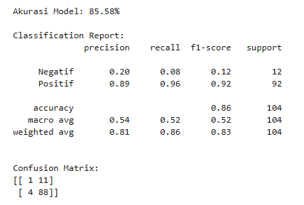
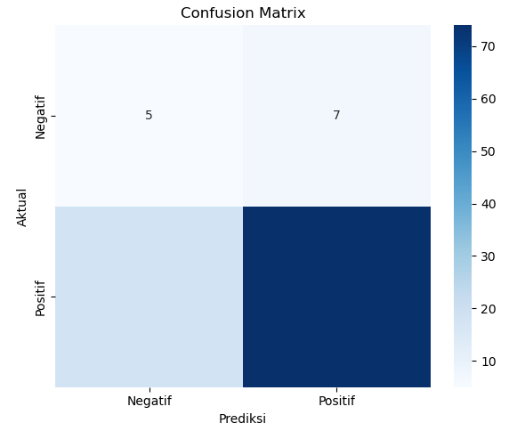
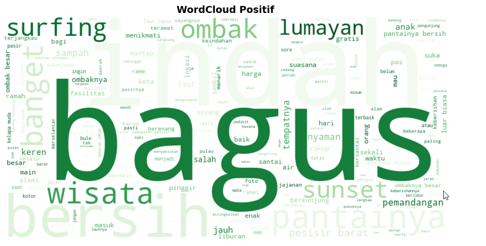
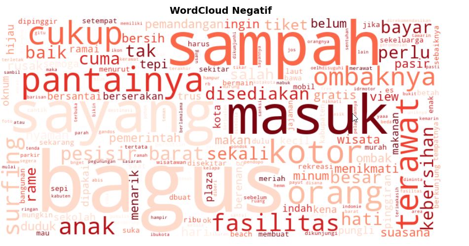

<h1>Isi Repositori</h1>
Repository ini bertujuan untuk menganalisis sentimen pengunjung terhadap Pantai Labuhan Jukung, Krui, Lampung, berdasarkan ulasan yang diambil dari Google Maps. Dengan pendekatan klasifikasi Machine Learning (Naive Bayes Multinomial), ulasan diklasifikasikan menjadi sentimen Positif atau Negatif untuk memahami aspek apa yang paling disukai atau dikeluhkan oleh wisatawan terhadap Pantai Labuhan Jukung, Lampung.

 

<h1>Alur Kerja Repository</h1>
---

### 1. Persiapan Data
* **Load Dataset:** Membaca data mentah dari file `ulasan_pan.csv`.
* **Labeling Sentimen:** Mengonversi rating numerik menjadi label kategori agar sesuai untuk analisis sentimen:
    * **Rating 1-3:**  Negatif
    * **Rating 4-5:**  Positif

### 2.  Pre-processing Teks
Sebelum masuk ke model, teks dibersihkan melalui tahapan:
* **Case Folding**
* **Data Cleaning** 
* **Stopwords Removal**

### 3. Penerapan Model
* **Train-Test Split:** Membagi data dengan rasio **80% Training** dan **20% Testing**. Menggunakan teknik *stratify* untuk menjaga keseimbangan distribusi kelas di kedua data.
* **Vectorization:** Menggunakan `CountVectorizer` untuk mengubah teks mentah menjadi representasi angka (vektor frekuensi kata).
* **Training Model:** Mengimplementasikan algoritma **Multinomial Naive Bayes** melalui `Pipeline` Scikit-Learn untuk proses yang terintegrasi.

### 4.  Evaluasi & Insight
* **Model Performance:** Mengukur akurasi menggunakan *Classification Report* dan *Confusion Matrix*.
* **Data Visualization:** Menghasilkan Word Cloud per sentimen untuk melihat kata kunci dominan dan grafik distribusi rating.

---

 

# Hasil Visualisasi 

Berdasarkan analisis sentimen yang dilakukan pada dataset ulasan **Pantai Labuhan Jukung, Lampung**, berikut adalah temuan utama yang direpresentasikan melalui visualisasi data:

###  Statistik & Distribusi Sentimen
Secara keseluruhan, sentimen positif mendominasi ulasan, namun terdapat *pain points* krusial yang ditemukan pada ulasan negatif.

| Distribusi Sentimen | Confusion Matrix |
| :---: | :---: |
|  |  |
| *Visualisasi jumlah ulasan Positif, Netral, dan Negatif.* | *Evaluasi performa model Naive Bayes dalam memprediksi kelas.* |

 

###  Analisis Kata Dominan (WordCloud)

Visualisasi WordCloud di bawah ini menunjukkan perbedaan kontras antara aspek yang dipuji oleh pengunjung dan aspek yang dikeluhkan:

#### Wordcloud Positif: Daya Tarik Utama
Pemandangan alam yang indah dan aktivitas surfing menjadi daya tarik magnet bagi pengunjung.
 

####  Wordcloud Negatif: Keluhan Pengunjung
Isu kebersihan (sampah/kotor) dan kerusakan fasilitas menjadi penghambat utama kenyamanan wisata.
 

---

 

##  Insight 

Berdasarkan ekstraksi fitur dari model dan visualisasi data, berikut adalah poin-poin strategis mengenai kondisi **Pantai Labuhan Jukung**:

### Sentimen Negatif
Area-area berikut memerlukan perhatian segera dari pihak pengelola untuk meningkatkan kualitas pelayanan:

| Kata Kunci | Frekuensi | Deskripsi Insight |
| :--- | :---: | :--- |
| **bagus** | 22x | Sering muncul dalam kalimat: *"Pantai **bagus**, tapi pengelolaan **buruk**"*. |
| **sampah** | 10x | Kebersihan pantai dari sampah sisa pengunjung masih menjadi masalah utama. |
| **sayang** | 9x | Kekecewaan pengunjung terhadap ekspektasi yang tidak dipenuhi |
| **masuk** | 8x | Kendala pada jalur masuk pantai atau tiket masuk. |
| **kotor** | 7x | Area fasilitas umum membutuhkan pembersihan rutin. |
| **terawat** | 7x | Indikasi bahwa sarana pendukung  mulai mengalami kerusakan. |

> [Catatan]
> **Pola Kalimat:** Kata **"bagus"** muncul di ulasan negatif karena terdapat kalimat seperti: *"Pantainya **bagus**, tapi sayangnya sangat **kotor**"*. Ini menunjukkan pengunjung sebenarnya sangat mengagumi potensi alamnya, namun kecewa pada aspek operasional.

 

### Keunggulan Utama (Sentimen Positif)
Faktor-faktor yang menjadi alasan utama pengunjung merekomendasikan destinasi ini:

| Kata Kunci | Frekuensi | Deskripsi Insight |
| :--- | :---: | :--- |
| **bagus** | 109x | Indikator kepuasan umum yang sangat tinggi. |
| **indah** | 89x | *Value* utama pada aspek visual, terutama pemandangan *sunset*. |
| **bersih** | 62x | Apresiasi pada area pantai yang masih terjaga keasliannya. |
| **ombak** | 51x | Identitas kuat sebagai destinasi favorit komunitas *surfing*. |
| **pesisir** | 33x | Potensi luasnya area pantai sebagai daya tarik wisata keluarga. |
---

##  Kesimpulan & Rekomendasi
1. **Peningkatan Manajemen Kebersihan:** Kata "sampah" dan "kotor" merupakan *pain points* utama. Diperlukan penambahan titik pembuangan sampah dan petugas kebersihan berkala.
2. **Pemeliharaan Sarana:** Kata "terawat" menunjukkan adanya fasilitas yang mulai rusak; renovasi kecil pada toilet atau gazebo akan meningkatkan *user experience*.

 

###  Proyek Terkait
Lihat juga pengolahan data ulasan Pantai Labuhan Jukung dengan pendekatan lainnya disini:

* **Analisis Sentimen (Rule-Based):** [Wahyu-hdt/Analisis-Sentimen-Rule-Based](https://github.com/Wahyu-hdt/Analisis-Sentimen-Rule-Based)
  > Pendekatan menggunakan kamus kata (*lexicon*) untuk menentukan polaritas sentimen tanpa melalui proses training model.
